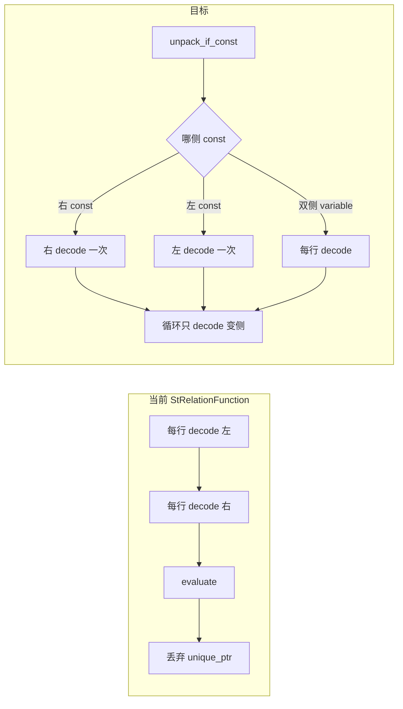

# Geo 执行层 Batch / 对象复用实施计划

> 来源：内部 plan `geo_batch_reuse`。本文档为可读版，每个 Phase 附 SQL / 行为示例。  
> **不属于常量折叠**：优化发生在 BE 执行期，不是 FE 编译期把表达式算死。

## 目标与边界

| 做 | 不做 |
|----|------|
| 降低 BE 标量 Geo 函数每行 CPU（decode / 分配 / 重复构造） | 空间索引 |
| 对齐已有 `StDistance` 的 const/vector 三分支 | 原生 `GEOMETRY` 类型 |
| 轻量读类型头，避免无意义的完整 S2 decode | FE 对 `st_*` 的常量折叠 |
| | 改 VARCHAR 存储格式 |

### 主改文件

- [`be/src/exprs/function/geo/functions_geo.cpp`](../../be/src/exprs/function/geo/functions_geo.cpp)
- [`be/src/exprs/function/geo/functions_geo.h`](../../be/src/exprs/function/geo/functions_geo.h)（已有未使用的 `StContainsState`）
- [`be/src/exprs/function/geo/geo_types.h/.cpp`](../../be/src/exprs/function/geo/geo_types.cpp)
- UT：`be/test/exprs/function/geo/`
- 回归：`regression-test/suites/query_p0/sql_functions/spatial_functions/`

---

## 现状（瓶颈）

`StRelationFunction`（`st_contains` / `st_intersects` / `st_disjoint` / `st_touches`）当前路径：

```cpp
// be/src/exprs/function/geo/functions_geo.cpp — StRelationFunction::execute
for (int row = 0; row < size; ++row) {
    auto lhs_value = left_col.value_at(row);
    auto rhs_value = right_col.value_at(row);
    std::unique_ptr<GeoShape> shape1(GeoShape::from_encoded(...));  // 每行
    std::unique_ptr<GeoShape> shape2(GeoShape::from_encoded(...));  // 每行，即使右侧相同
    auto relation_value = Func::evaluate(shape1.get(), shape2.get());
}
```

已有可对齐模板：同文件中 `StDistance` 的 `unpack_if_const` + `const_vector` / `vector_const` / `vector_vector`。



---

## Phase 1：关系函数 Const 三分支（最高 ROI，先做）

### 要做什么

改造 `StRelationFunction`，对齐 `StDistance`：

1. `unpack_if_const` 左右列。
2. 抽出共用 `decode_shape(StringRef) -> unique_ptr<GeoShape>`。
3. 三个分支：
   - **right_const / vector_const**：右侧只 `from_encoded` 一次；循环内只 decode 左侧。
   - **left_const / const_vector**：对称。
   - **vector_vector**：两侧都变；语义不变，可顺带循环外复用两个 `unique_ptr` 槽位。
4. 一侧为 const 且 decode 失败：整列置 NULL（与 `StDistance` 一致）。

不启用现有空壳 `StContainsState`；不做 FE 常量折叠。

### 示例说明

#### 例 1：右侧常量（最常见，收益最大）→ `vector_const`

```sql
SELECT id
FROM geo_table
WHERE ST_Contains(region, ST_Point(116.4, 39.9));
--                  ↑ 列（每行不同）  ↑ 字面量（整列相同）
```

假设 3 行：

| 行 | region | 右侧点 |
|----|--------|--------|
| 1 | 朝阳区多边形 | POINT(116.4 39.9) |
| 2 | 海淀区多边形 | POINT(116.4 39.9) |
| 3 | 西城区多边形 | POINT(116.4 39.9) |

| | decode 次数 |
|--|-------------|
| **现在** | 左 3 + 右 3 = **6**（右边重复解了 3 次） |
| **Phase 1 后** | 右 **1** + 左 3 = **4** |

百万行时：右边从 100 万次 decode → **1 次**。

#### 例 2：左侧常量 → `const_vector`

```sql
SELECT id
FROM pois
WHERE ST_Contains(
    ST_GeomFromText('POLYGON ((116 39, 117 39, 117 40, 116 40, 116 39))'),
    location
);
-- 左侧固定大区，右侧每行一个点
```

大 Polygon 的 decode 很贵：左边只解一次，循环只解点。

#### 例 3：两侧都是列 → `vector_vector`

```sql
SELECT id FROM geo_table
WHERE ST_Contains(region, location);
```

每行左右都变，**不能少 decode 次数**；只做循环外 `unique_ptr` 复用，去掉循环内临时构造噪音。

#### 例 4：const 侧非法 → 整列 NULL

```sql
-- 若右侧常量 blob decode 失败（非法几何）
WHERE ST_Contains(region, <非法常量几何>)
```

右侧只解析一次；失败则整列结果为 NULL，不再逐行重试（对齐 `st_distance`）。

### 验证

- UT：`function_geo_test.cpp` 覆盖 const-vector / vector-const / vector-vector。
- 回归：`test_gis_function.groovy`。
- 可选：对比 `WHERE ST_Contains(region, ST_Point(116.4, 39.9))` 的 CPU。

### 与常量折叠的区别

| | FE 常量折叠 | Phase 1 |
|--|-------------|---------|
| 时机 | 计划生成前 | BE 执行时 |
| 结果 | 可能变成计划里的常量/`TRUE` | 仍是 `st_contains`，每行仍 `evaluate` |
| Geo 现状 | `st_*` 被跳过 | 本 Phase 要做的 |

---

## Phase 2：轻量路径 — `ST_GeometryType` / 复核 `ST_X`·`ST_Y`

### 2a `ST_GeometryType`：只读编码头

编码布局：

```text
[0x00][GeoShapeType][S2 payload...]
 保留    类型枚举     坐标等（本函数不需要）
```

类型名与枚举一一对应，只需前 2 字节即可映射 `"ST_POINT"` / `"ST_POLYGON"` 等。

在 `geo_types` 增加 helper（如 `GeoShape::type_name_from_encoded`），`StGeometryType::execute` 改用它；非法头仍返回 NULL。

#### 示例

```sql
SELECT id, ST_GeometryType(geom) FROM geo_table;
```

| blob 前缀 | 现在（重） | Phase 2 后（轻） |
|-----------|------------|------------------|
| `00 01` + 点坐标 | `new GeoPoint` + 解整段坐标 → `"ST_POINT"` | 读类型字节 `01` → `"ST_POINT"` |
| `00 03` + 大多边形 | `new GeoPolygon` + 解整棵 S2 树 → `"ST_POLYGON"` | 读 `03` → `"ST_POLYGON"` |

多边形越大，省得越多；结果字符串与现在一致。

### 2b `ST_X` / `ST_Y`：复核为主

```sql
SELECT ST_X(ST_Point(116.397128, 39.916527));
-- 当前对外对齐约 13 位小数行为
```

**现状**：已用栈上 `GeoPoint` + `decode_from`，不再 `from_encoded` 分配未知类型。  
**默认策略**：对外保持与回归一致的 13 位行为，避免无谓变更；`StrFormat`+`stod` 热点若 profiling 证实再单开小改。

> 2b 不是主菜；主菜是 2a。

---

## Phase 3：循环内分配减负（有限度）

### 要做什么

在 Phase 1 的 `vector_vector` / 变侧循环上：

- 循环外预置左右各一个 `unique_ptr<GeoShape>`，每行赋值复用智能指针对象。
- **首版不做**全局/线程本地 `GeoShape` 对象池（Point/Polygon/MultiPolygon 形态不一，易错且收益未证实）。
- **首版不做**通用 dict/重复 blob cache（const 侧已由 Phase 1 覆盖）。

### 示例

```sql
-- 两侧都是列：无法少 decode，只能少「分配噪音」
WHERE ST_Contains(region, location)
```

伪代码对比：

```cpp
// 现在：每行两个临时 unique_ptr 从构造到析构
for (...) {
    unique_ptr<GeoShape> a = from_encoded(...);
    unique_ptr<GeoShape> b = from_encoded(...);
    evaluate(a.get(), b.get());
}

// Phase 3：槽位在循环外，每行只替换所指对象
unique_ptr<GeoShape> a, b;
for (...) {
    a = from_encoded(...);
    b = from_encoded(...);
    evaluate(a.get(), b.get());
}
```

---

## Phase 4：同类函数扫尾（follow-up）

### 要做什么

- `st_distance`：已是模板，**不改语义**。
- 一元函数如 `st_length` / `st_area_*` / `st_astext`：可做「循环外复用 `unique_ptr`」，默认放在关系函数之后，避免 PR1 过大。

### 示例

```sql
-- 每行仍要 decode，但少 unique_ptr 临时构造
SELECT ST_AsText(region), ST_Length(boundary), ST_Area_Square_Meters(region)
FROM geo_table;
```

优化形态同 Phase 3（循环外一个 `unique_ptr` 槽位），**不是** Phase 1 的 const 三分支（一元函数没有「另一侧常量」）。

---

## 测试与质量门槛

- BE UT：`./run-be-ut.sh`，覆盖 geo 相关用例。
- 回归：`run-regression-test.sh -d query_p0/sql_functions/spatial_functions`。
- 风格：`build-support/clang-format.sh` / `check-format.sh`；有编译库时对改动文件 clang-tidy。
- **结果必须与改前一致**（含 NULL / 非法 blob）；不为了快改边界语义。

---

## 交付物与 PR 切分

### 交付物

1. 代码：`StRelationFunction` 三分支 + `ST_GeometryType` 轻量读类型。
2. UT + 回归通过。
3. 回写 [`优化项.md`](./优化项.md) / [`geo-spatial-design.md`](./geo-spatial-design.md) §7.3：标明已做 / 对象池未做。

### 建议合入

| PR | 内容 |
|----|------|
| **PR1** | Phase 1（关系函数三分支）+ UT/回归 |
| **PR2** | Phase 2（`ST_GeometryType`）+ Phase 3/4 一元扫尾 |

对象池与 dict 短路 **不进入** 第一批 PR。

---

## 任务清单

| ID | 内容 | 状态 |
|----|------|------|
| phase1-relation-const | `StRelationFunction` 三分支 + UT/回归 | pending |
| phase2-geometry-type | encoded 头读 type_name；`StGeometryType` 去 full decode | pending |
| phase2-xy-review | 复核 `ST_X`/`ST_Y`，保持 13 位对外语义 | pending |
| phase3-loop-reuse | vector_vector 循环外复用 `unique_ptr`；不做通用对象池 | pending |
| phase4-unary-followup | （可选）`st_astext`/`st_length`/`st_area` 循环外复用 | pending |
| docs-update | 更新优化项 / geo-spatial-design 执行性能段 | pending |

---

## 附录：StarRocks 的 const 缓存设计（参考实现）

StarRocks 已经实现了 Phase 1 的核心优化，且机制更完整——使用函数框架的 **prepare / execute / close 三阶段生命周期**，而不是在 execute 内做 `unpack_if_const`。

### 设计对比

| | Doris Phase 1 方案 | StarRocks 现有实现 |
|--|-------------------|-------------------|
| **检测时机** | execute 内 `unpack_if_const` | prepare 阶段 `ctx->is_constant_column()` |
| **缓存载体** | 函数内局部变量 | `FunctionContext::get_function_state(FRAGMENT_LOCAL)` |
| **生命周期** | 单次 execute 调用 | 由框架管理：prepare → execute → close，跨 batch |
| **范围** | 仅关系函数 | 所有 geo 函数均可复用此模式 |

### StarRocks 实现详解

#### 1. 状态结构体

```cpp
// StarRocks geo_functions.cpp
struct StContainsState {
    StContainsState() = default;
    ~StContainsState() {
        delete shapes[0];
        delete shapes[1];
    }
    bool is_null{false};
    GeoShape* shapes[2]{nullptr, nullptr};  // 缓存左右两侧 decode 结果
};
```

#### 2. Prepare 阶段：提前 decode const 列

```cpp
Status GeoFunctions::st_contains_prepare(FunctionContext* ctx, FunctionContext::FunctionStateScope scope) {
    if (scope != FunctionContext::FRAGMENT_LOCAL) return Status::OK();

    if (!ctx->is_constant_column(0) && !ctx->is_constant_column(1)) {
        return Status::OK();  // 两侧都非常量，没必要缓存
    }

    auto contains_ctx = new StContainsState();
    for (int i = 0; !contains_ctx->is_null && i < 2; ++i) {
        if (ctx->is_constant_column(i)) {               // 检查第 i 列是否是常量
            auto str_column = ctx->get_constant_column(i);  // 拿到常量列
            if (str_column->only_null()) {
                contains_ctx->is_null = true;
            } else {
                auto str_value = ColumnHelper::get_const_value<TYPE_VARCHAR>(str_column);
                contains_ctx->shapes[i] = GeoShape::from_encoded(str_value.data, str_value.size);
                if (contains_ctx->shapes[i] == nullptr) {
                    contains_ctx->is_null = true;       // decode 失败 → 整列 NULL
                }
            }
        }
    }

    ctx->set_function_state(scope, contains_ctx);  // 存入函数上下文
    return Status::OK();
}
```

关键 API：
- **`ctx->is_constant_column(i)`**：框架提供，判断第 i 列是否整列相同（字面量或 const 折叠后的列）
- **`ctx->get_constant_column(i)`**：取整列共享的那个 ColumnPtr，只读一次
- **`ctx->set_function_state(scope, state)`**：跨 execute 调用持久化

#### 3. Execute 阶段：复用缓存

```cpp
StatusOr<ColumnPtr> GeoFunctions::st_contains(FunctionContext* context, const Columns& columns) {
    const StContainsState* state =
            reinterpret_cast<StContainsState*>(context->get_function_state(FRAGMENT_LOCAL));

    if (state != nullptr && state->is_null) {
        return ColumnHelper::create_const_null_column(size);  // const 侧非法 → 整列 NULL
    }

    for (int row = 0; row < size; ++row) {
        GeoShape* shapes[2] = {nullptr, nullptr};
        // 核心：用 state->shapes[i] 替代逐行 decode
        for (int i = 0; i < 2; ++i) {
            if (state != nullptr && state->shapes[i] != nullptr) {
                shapes[i] = state->shapes[i];           // ← 从缓存取，零成本
            } else {
                shapes[i] = GeoShape::from_encoded(...); // 非常量，逐行 decode
            }
        }
        result.append(shapes[0]->contains(shapes[1]));
    }
}
```

#### 4. Close 阶段：清理

```cpp
Status GeoFunctions::st_contains_close(FunctionContext* ctx, FunctionContext::FunctionStateScope scope) {
    if (scope == FunctionContext::FRAGMENT_LOCAL) {
        auto* contains_ctx = reinterpret_cast<StContainsState*>(ctx->get_function_state(scope));
        delete contains_ctx;  // 析构时会 delete shapes[0]/shapes[1]
    }
    return Status::OK();
}
```

#### 5. 注册方式

```cpp
// StarRocks 通过 gen_cpp/opcode/GeoFunctions.inc 注册
// 框架自动将 prepare/execute/close 三个函数关联到同一函数名
```

### 效果实测场景

```sql
-- 场景 1：右侧常量（最常见）
SELECT id FROM geo_table
WHERE ST_Contains(region, ST_Point(116.4, 39.9));
```
| | 左 | 右 | contains 调用 |
|--|----|----|--------------|
| Doris 现状 | 每行 decode | 每行 decode | 每次 |
| StarRocks | 每行 decode | prepare 阶段 decode **一次** | 每次 |
| **节省** | - | decode 次数从 N → 1 | - |

```sql
-- 场景 2：左侧常量（大多边形）
SELECT id FROM geo_table
WHERE ST_Contains(ST_GeomFromText('POLYGON((...))'), location);
```
大多边形 decode 代价高，prepare 阶段只解一次，收益更显著。

```sql
-- 场景 3：两侧都非常量
SELECT id FROM geo_table
WHERE ST_Contains(region, location);
```
不命中 const 缓存，退化为逐行 decode——与 Doris 当前行为一致。

### 对 Doris Phase 1 的启示

1. **StarRocks 的 prepare 方案更通用**，不限于 `StRelationFunction`，`st_circle`、`st_from_wkt` 等构造函数也复用同一模式
2. **依赖框架 API**：`is_constant_column()` / `get_constant_column()` / `set_function_state()`。Doris 需要先确认函数框架是否已提供类似能力，或等价替代方案
3. **Phase 1 的 `unpack_if_const` 是轻量替代**：不需 prepare/close 注册，在 execute 内用模板分支也能达到相同效果，只是代码可维护性稍弱
4. **两套方案不冲突**：可在 Phase 1 先用 `unpack_if_const` 快速落地，后续参考 StarRocks 的设计演进到 prepare 模式
