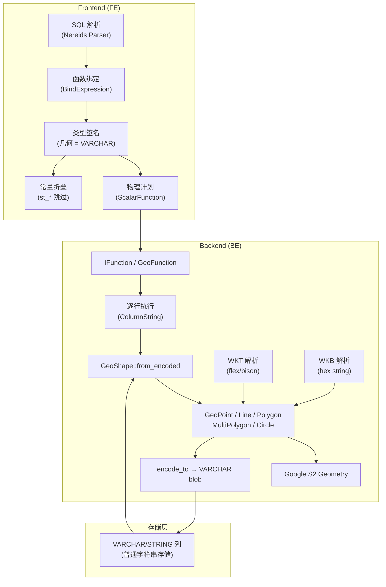
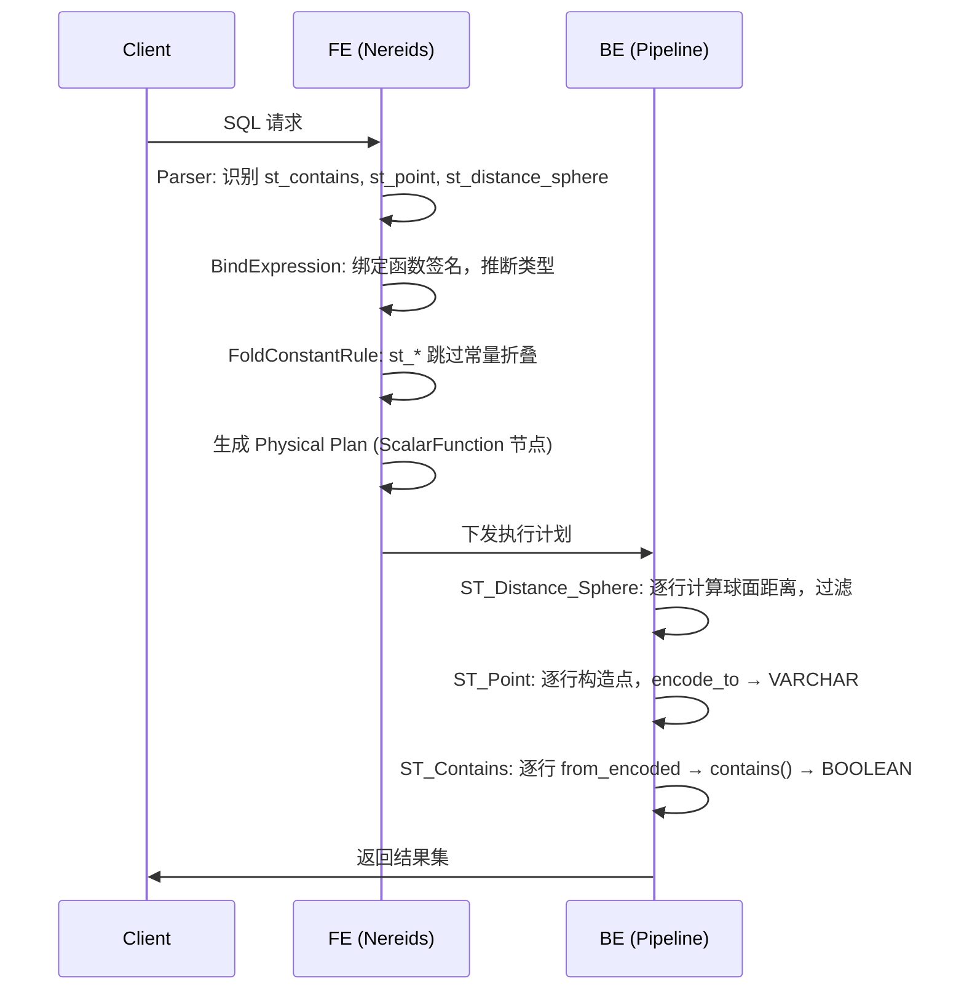

# Doris Geo/Spatial 架构设计

本文档描述 Apache Doris 地理空间（Geo/Spatial）能力的整体架构设计，以及 Frontend（FE）与 Backend（BE）的具体实现。

## 1. 设计概述

### 1.1 设计定位

Doris 的 Geo 能力采用 **"函数层 GIS + VARCHAR 载体"** 模型，而非 PostGIS 式的 **"原生 GEOMETRY 类型 + 空间索引"** 模型。核心设计原则如下：

- **无原生 GEOMETRY 列类型**：几何对象在 SQL 类型系统中以 `VARCHAR`/`STRING` 表示，内部承载 Doris 自定义的二进制编码。
- **计算下沉 BE**：所有几何解析、空间关系判断、度量计算均在 BE 执行，FE 仅负责函数注册、类型检查与计划翻译。
- **球面几何模型**：BE 基于 Google S2 Geometry 库实现，坐标语义为经纬度（x = 经度，y = 纬度）。
- **兼容 OGC 子集**：支持常见 `ST_*` 函数及 WKT/WKB 输入输出，覆盖 Point、LineString、Polygon、MultiPolygon 等基础类型。

### 1.2 整体架构



### 1.3 模块边界

| 层级 | 职责 | 不负责 |
|------|------|--------|
| FE | 函数注册、签名推断、计划生成、MySQL 协议兼容 | 几何解析、空间计算、存储编码 |
| BE `exprs/function/geo/` | WKT/WKB 解析、几何编解码、空间关系与度量 | 存储层索引、谓词下推 |
| 存储层 | 与普通 STRING 列相同存储 | 空间索引、Zone Map 空间过滤 |

---

## 2. Frontend 实现

### 2.1 类型系统

Doris FE **没有** `GEOMETRY` / `GEOGRAPHY` 原生列类型：

- `fe/fe-type/.../Type.java` 与 `PrimitiveType.java` 中均无 GEOMETRY 枚举。
- `DorisParser.g4` 语法文件中无 `GEOMETRY` 类型关键字，`CREATE TABLE ... GEOMETRY` 不被原生支持。
- 几何输入/输出在函数签名中统一映射为 `VarcharType.SYSTEM_DEFAULT`。

MySQL 协议层保留了兼容定义：

```java
// fe/fe-type/.../MysqlColType.java
MYSQL_TYPE_GEOMETRY(255, "GEOMETRY", "GEOMETRY")
```

该定义仅用于 MySQL wire protocol 兼容，不代表 Doris 内部支持 GEOMETRY 列类型。

**推荐用法**：使用 `VARCHAR` 列存储经 `ST_Point`、`ST_GeomFromText` 等函数编码后的二进制 blob。

```sql
CREATE TABLE geo_table (
    id INT,
    location VARCHAR(512),   -- 存储 ST_Point 编码结果
    region   VARCHAR(4096)   -- 存储 ST_GeomFromText 编码结果
);
```

### 2.2 函数注册

所有 Geo 函数在 `BuiltinScalarFunctions.java` 中注册，对应 Nereids 表达式类位于：

```
fe/fe-core/src/main/java/org/apache/doris/nereids/trees/expressions/functions/scalar/St*.java
```

每个 `St*` 类遵循统一模式：

- 实现 `ExplicitlyCastableSignature`，声明参数与返回类型。
- 实现 `AlwaysNullable`（输入为 NULL 时返回 NULL）。
- 通过 `ScalarFunctionVisitor` 提供 `visitSt*` 访问方法。
- 多数类由 `GenerateFunction` 工具自动生成。

以 `StContains` 为例：

```java
public static final List<FunctionSignature> SIGNATURES = ImmutableList.of(
    FunctionSignature.ret(BooleanType.INSTANCE)
        .args(VarcharType.SYSTEM_DEFAULT, VarcharType.SYSTEM_DEFAULT)
);
```

几何参数与返回值均为 `VARCHAR`，关系判断函数返回 `BOOLEAN`，度量函数返回 `DOUBLE`，`ST_Geometries` 返回 `ARRAY<VARCHAR>`。

### 2.3 SQL 处理流程

#### 解析（Parsing）

`ST_*` 函数作为普通标量函数调用解析，无专用 grammar 规则。例如：

```sql
SELECT ST_Contains(region, ST_Point(lng, lat)) FROM geo_table;
```

#### 绑定与类型检查（Binding）

`BindExpression` 通过 `FunctionRegistry` 查找 `BuiltinScalarFunctions` 中注册的函数，按 `FunctionSignature` 做参数类型推断与隐式转换。Geo 函数无特殊绑定逻辑，走通用标量函数路径。

#### 计划生成（Planning）

Geo 函数翻译为通用 `ScalarFunction` 物理算子，下发至 BE 执行。当前 **没有** Geo 专用的：

- Physical Plan 节点
- Join Rewrite 规则
- 谓词下推（Predicate Pushdown）规则
- 空间索引扫描算子

#### 常量折叠（Constant Folding）

`FoldConstantRuleOnBE` 对 `st_*` 函数做了显式跳过：

```java
// Frontend can not represent geo types
if (expr instanceof BoundFunction
        && ((BoundFunction) expr).getName().toLowerCase().startsWith("st_")) {
    return true;
}
```

原因：FE 无法在编译期表示 Geo 二进制编码结果，因此所有 `st_*` 表达式不参与 BE 常量折叠优化。

### 2.4 外部数据源支持

| 数据源 | GEOMETRY 类型处理 |
|--------|-------------------|
| 原生 Doris 表 | 不支持 GEOMETRY 列，使用 VARCHAR |
| JDBC（SAP HANA 等） | `ST_GEOMETRY` / `ST_POINT` → `Type.UNSUPPORTED` |
| Iceberg | Literal 解析有 GEOMETRY/GEOGRAPHY 分支，但 schema 映射未实现 |
| MySQL 协议 | `MYSQL_TYPE_GEOMETRY` 仅 wire 兼容 |

SPATIAL INDEX 仅有 MySQL 兼容错误码（如 `ERR_SPATIAL_MUST_HAVE_GEOM_COL`），FE 中无实际实现。

### 2.5 FE 关键文件

| 文件 | 职责 |
|------|------|
| `fe/fe-core/.../catalog/BuiltinScalarFunctions.java` | 32 个 `st_*` 函数注册 |
| `fe/fe-core/.../nereids/trees/expressions/functions/scalar/St*.java` | 各函数签名与 Nereids 表达式节点 |
| `fe/fe-core/.../nereids/rules/expression/rules/FoldConstantRuleOnBE.java` | `st_*` 常量折叠跳过 |
| `fe/fe-core/.../nereids/rules/analysis/BindExpression.java` | 通用函数绑定 |
| `fe/fe-type/.../catalog/MysqlColType.java` | MySQL GEOMETRY 协议类型 |
| `fe/fe-core/.../trees/expressions/visitor/ScalarFunctionVisitor.java` | `visitSt*` 访问接口 |

---

## 3. Backend 实现

BE 端所有 Geo 实现集中在单一目录：

```
be/src/exprs/function/geo/
```

### 3.1 目录结构与模块职责

```
be/src/exprs/function/geo/
├── geo_common.h/.cpp          # GeoShapeType、GeoParseStatus 枚举
├── geo_types.h/.cpp           # GeoShape 类层次与空间算法（核心，约 2000 行）
├── functions_geo.h/.cpp       # ST_* SQL 函数实现与注册
├── wkt_lex.l / wkt_yacc.y     # WKT 词法/语法分析（flex/bison）
├── wkt_parse.h/.cpp           # WKT 解析入口
├── wkt_parse_ctx.h            # WKT 解析上下文
├── wkt_parse_type.h           # GeoCoordinate 坐标结构
├── wkb_parse.h/.cpp           # WKB 十六进制字符串解析
├── wkb_parse_ctx.h            # WKB 解析上下文
├── geo_tobinary.h/.cpp        # GeoShape → OGC WKB 输出
├── geo_tobinary_type.h        # WKB 类型常量
├── ByteOrderValues.h/.cpp     # 大小端读写
├── ByteOrderDataInStream.h    # WKB 二进制流
└── machine.h                  # 本机字节序检测
```

函数注册入口在 `simple_function_factory.h`，BE 启动时调用 `register_function_geo()`。

### 3.2 核心数据结构

#### GeoShapeType 枚举

```cpp
enum GeoShapeType {
    GEO_SHAPE_ANY = 0,
    GEO_SHAPE_POINT = 1,
    GEO_SHAPE_LINE_STRING = 2,
    GEO_SHAPE_POLYGON = 3,
    GEO_SHAPE_MULTI_POINT = 4,        // 枚举存在，无实现类
    GEO_SHAPE_MULTI_LINE_STRING = 5,  // 枚举存在，无实现类
    GEO_SHAPE_MULTI_POLYGON = 6,
    GEO_SHAPE_CIRCLE = 7,             // Doris 特有，非 OGC 标准
};
```

#### GeoShape 类层次

```
GeoShape (抽象基类)
├── GeoPoint        → S2Point
├── GeoLine         → S2Polyline
├── GeoPolygon      → S2Polygon
├── GeoMultiPolygon → vector<S2Polygon>
└── GeoCircle       → S2Cap（Doris 特有）
```

`GeoShape` 提供统一接口：

- **编解码**：`encode_to()` / `from_encoded()` / `decode_from()`
- **格式转换**：`from_wkt()` / `from_wkb()` / `as_wkt()` / `as_binary()`
- **空间关系**：`contains()` / `intersects()` / `disjoint()` / `touches()`
- **度量**：`Distance()` / `Length()` / `ComputeArea()`
- **组件访问**：`num_geometries()` / `num_points()` / `GeometryType()`

#### 坐标约定

- **x = 经度（longitude）**，范围 `[-180, 180]`
- **y = 纬度（latitude）**，范围 `[-90, 90]`
- 内部通过 `S2LatLng::FromDegrees(lat, lng)` 转换为 `S2Point` 球面坐标

### 3.3 Doris 内部二进制编码

几何对象在 VARCHAR 列中以自定义二进制格式存储：

```
┌──────────┬──────────────┬─────────────────┐
│ 0x00     │ GeoShapeType │ payload         │
│ (1 byte) │ (1 byte)     │ (变长)          │
│ 保留字节  │ 类型标识      │ 类型相关数据     │
└──────────┴──────────────┴─────────────────┘
```

编码逻辑（`GeoShape::encode_to`）：

```cpp
void GeoShape::encode_to(std::string* buf) {
    buf->push_back(0X00);           // 保留字节
    buf->push_back((char)type()); // 类型标识
    encode(buf);                    // 类型相关 payload
}
```

解码逻辑（`GeoShape::from_encoded`）：

1. 校验 `size >= 2` 且首字节为 `0x00`
2. 根据第二字节 `GeoShapeType` 创建对应 `GeoShape` 子类
3. 调用 `decode(ptr + 2, size - 2)` 解析 payload

各类型 payload 格式：

| 类型 | Payload 内容 |
|------|-------------|
| GeoPoint | `sizeof(S2Point)` 原始内存（3 × double） |
| GeoLine | `S2Polyline::Encode()` |
| GeoPolygon | `S2Polygon::Encode()` |
| GeoMultiPolygon | `varint32` 多边形数量 + 各 `S2Polygon::Encode()` |
| GeoCircle | `S2Cap::Encode()` |

### 3.4 WKT 解析

WKT（Well-Known Text）解析使用 **flex + bison** 实现：

- `wkt_lex.l`：词法分析，识别 `POINT`、`LINESTRING`、`POLYGON`、`MULTIPOLYGON` 等 token
- `wkt_yacc.y`：语法分析，构建 `GeoShape` 对象
- `WktParse::parse_wkt()`：对外入口

支持的 WKT 类型：

| WKT 类型 | 状态 |
|----------|------|
| POINT | 支持 |
| LINESTRING | 支持 |
| POLYGON | 支持（含洞） |
| MULTIPOLYGON | 支持 |
| MULTIPOINT | lexer 有 token，grammar 无规则 |
| MULTILINESTRING | lexer 有 token，grammar 无规则 |
| CIRCLE | 不支持（仅 `ST_Circle()` 函数构造） |

解析校验规则：

- 多边形环必须闭合（首尾坐标相同）
- 洞（hole）必须被外环包含
- MultiPolygon 内多边形不得重叠
- 坐标仅支持二维（无 Z/M 维度）

### 3.5 WKB 解析与输出

#### 输入（`ST_GeometryFromWKB` / `ST_GeomFromWKB`）

- 输入为 **十六进制字符串**（非 raw binary）
- 支持 PostgreSQL 风格 `\x` 前缀
- 支持 NDR/XDR 字节序
- 支持 SRID 标志位（`0x20000000`，读取时跳过）
- 仅解析 **Point(1)、LineString(2)、Polygon(3)**

#### 输出（`ST_AsBinary`）

- 将 `GeoShape` 编码为标准 OGC WKB
- 转为小写十六进制字符串，前缀 `\x`
- 仅支持 Point / LineString / Polygon
- MultiPolygon、Circle 等返回失败

### 3.6 空间算法

BE 基于 **Google S2 Geometry v0.10.0**（`thirdparty/vars.sh` 中声明依赖）实现球面几何计算。

#### 空间关系

| 关系 | 实现要点 |
|------|----------|
| `contains` | 多边形用 `S2Polygon::Contains`；边界上的点不算包含（容差 `TOLERANCE=1e-6`） |
| `intersects` | 主要使用 S2 API；多边形-多边形纯边界相交场景有 `polygon_touch_polygon` 补救逻辑 |
| `disjoint` | 基于 `intersects` 取反 |
| `touches` | 自定义端点/边界检测（`is_line_touches_line` 等） |

#### 度量计算

| 度量 | 实现 |
|------|------|
| `st_distance` / `st_distance_sphere` | `S2Earth::GetDistanceMeters` 球面距离 |
| `st_length` | 线长/面周长/圆周，使用 `S2Earth::GetDistanceMeters` |
| `st_area_square_meters` / `st_area_square_km` | 球面立体角 → `S2Earth::SteradiansToSquareMeters/Km` |
| `st_angle` / `st_angle_sphere` | 三点夹角或两点球面角 |
| `st_azimuth` | 方位角计算 |

#### Doris 特有：ST_Circle

`ST_Circle(lng, lat, radius_meters)` 构造 `GeoCircle`（`S2Cap`），这是 Doris 扩展类型，非 OGC 标准几何。支持与其他类型的 contains/intersects/distance 等关系运算。

### 3.7 向量化执行集成

Geo 函数通过 `GeoFunction<Impl>` 模板适配 `IFunction` 接口：

```cpp
template <typename Impl>
class GeoFunction : public IFunction {
    Status execute_impl(FunctionContext* context, Block& block,
                        const ColumnNumbers& arguments,
                        uint32_t result, size_t input_rows_count) const override {
        return Impl::execute(block, arguments, result);
    }
};
```

执行模式为 **列式框架下的逐行循环**（非 SIMD 向量化）：

```cpp
for (int row = 0; row < size; ++row) {
    auto shape = GeoShape::from_encoded(data, len);  // 每行 decode
    // 空间计算
    res->insert_data(...);
}
```

特点：

- 使用 `ColumnView<TYPE_STRING/DOUBLE>` 读取输入列
- 每行独立 decode/encode `GeoShape`，无 batch 优化
- `st_distance` 对 const 列有三分支优化（const-vector / vector-const / vector-vector）
- `column_execute_util.h` 将 geo 函数列为"昂贵逐元素操作"
- 无专用 `ColumnGeo` 类型

Geo 函数作为普通标量函数参与 Pipeline 执行，无存储层下推。

### 3.8 BE 关键文件

| 文件 | 职责 |
|------|------|
| `geo_types.h/.cpp` | GeoShape 类层次、编解码、空间关系与度量算法 |
| `functions_geo.h/.cpp` | 全部 `st_*` 函数实现 + `register_function_geo()` |
| `wkt_lex.l` / `wkt_yacc.y` | WKT flex/bison 解析器 |
| `wkt_parse.h/.cpp` | WKT 解析入口 |
| `wkb_parse.h/.cpp` | WKB 十六进制解析 |
| `geo_tobinary.h/.cpp` | OGC WKB 输出 |
| `geo_common.h/.cpp` | 类型与错误码枚举 |
| `simple_function_factory.h` | 启动时注册 geo 函数 |

---

## 4. 支持的 SQL 函数

共 **32 个** `ST_*` 函数，按功能分类：

### 4.1 构造函数

| 函数 | 说明 |
|------|------|
| `ST_Point(lng, lat)` | 构造点，返回编码 VARCHAR |
| `ST_Circle(lng, lat, radius)` | 构造圆（Doris 特有），半径单位米 |
| `ST_Polygon(wkt)` | 从 WKT 构造多边形 |
| `ST_GeometryFromText(wkt)` | 从 WKT 构造几何对象 |
| `ST_GeomFromText(wkt)` | 同上（别名） |
| `ST_LineFromText(wkt)` | 从 WKT 构造线 |
| `ST_LineStringFromText(wkt)` | 同上（别名） |
| `ST_PolyFromText(wkt)` | 从 WKT 构造多边形 |
| `ST_PolygonFromText(wkt)` | 同上（别名） |
| `ST_GeometryFromWKB(hex)` | 从十六进制 WKB 构造 |
| `ST_GeomFromWKB(hex)` | 同上（别名） |

### 4.2 序列化函数

| 函数 | 说明 |
|------|------|
| `ST_AsText(geom)` | 编码几何 → WKT 文本 |
| `ST_AsWKT(geom)` | 同上（别名） |
| `ST_AsBinary(geom)` | 编码几何 → OGC WKB 十六进制 |

### 4.3 空间关系函数

| 函数 | 返回类型 | 说明 |
|------|----------|------|
| `ST_Contains(geom_a, geom_b)` | BOOLEAN | A 是否包含 B（边界不算） |
| `ST_Intersects(geom_a, geom_b)` | BOOLEAN | A 与 B 是否相交 |
| `ST_Disjoint(geom_a, geom_b)` | BOOLEAN | A 与 B 是否不相交 |
| `ST_Touches(geom_a, geom_b)` | BOOLEAN | A 与 B 是否仅边界接触 |

### 4.4 度量函数

| 函数 | 返回类型 | 说明 |
|------|----------|------|
| `ST_Distance(geom_a, geom_b)` | DOUBLE | 球面距离（米） |
| `ST_Distance_Sphere(lng1, lat1, lng2, lat2)` | DOUBLE | 两点球面距离（米） |
| `ST_Length(geom)` | DOUBLE | 线长或面周长（米） |
| `ST_Area_Square_Meters(geom)` | DOUBLE | 面积（平方米） |
| `ST_Area_Square_Km(geom)` | DOUBLE | 面积（平方千米） |
| `ST_Angle(p1, p2, p3)` | DOUBLE | 三点夹角 |
| `ST_Angle_Sphere(lng1, lat1, lng2, lat2)` | DOUBLE | 两点球面角 |
| `ST_Azimuth(p1, p2)` | DOUBLE | 方位角 |

### 4.5 组件访问函数

| 函数 | 返回类型 | 说明 |
|------|----------|------|
| `ST_X(point)` | DOUBLE | 点的经度 |
| `ST_Y(point)` | DOUBLE | 点的纬度 |
| `ST_GeometryType(geom)` | VARCHAR | 几何类型名称 |
| `ST_NumPoints(geom)` | INT | 坐标点数量（别名 `ST_NPoints`） |
| `ST_NumGeometries(geom)` | INT | 子几何对象数量 |
| `ST_Geometries(geom)` | ARRAY\<VARCHAR\> | 拆分为子几何数组 |

---

## 5. 查询执行流程

以如下查询为例：

```sql
SELECT id, ST_Contains(region, ST_Point(lng, lat)) AS inside
FROM geo_table
WHERE ST_Distance_Sphere(lng, lat, 116.4, 39.9) < 5000;
```



关键路径说明：

1. **FE 不做几何计算**：`ST_Point(116.4, 39.9)` 不会被常量折叠，即使参数是字面量。
2. **BE 逐行 decode**：`region` 列每行从 VARCHAR blob 解码为 `GeoShape`，再执行 `contains()`。
3. **无索引加速**：`ST_Distance_Sphere` 和 `ST_Contains` 均为全表逐行计算，无空间索引过滤。

---

## 6. 测试体系

### 6.1 BE 单元测试

位于 `be/test/exprs/function/geo/`：

| 文件 | 覆盖范围 |
|------|----------|
| `geo_types_test.cpp` | Point/Line/Polygon/MultiPolygon/Circle 的编解码、空间关系、距离、长度 |
| `wkt_parse_test.cpp` | 正常/非法 WKT 解析 |
| `wkb_parse_test.cpp` | 大小端、Point/LineString、非法输入 |
| `functions_geo_test.cpp` | `st_numgeometries`、`st_numpoints`、`st_geometries` |
| `function_geo_test.cpp` | `st_point`、`st_astext`、`st_x/y`、`st_distance_sphere`、`st_contains`、`st_circle`、`st_area_*` 等 |

### 6.2 FE 单元测试

| 文件 | 覆盖范围 |
|------|----------|
| `StGeoComponentFunctionsTest.java` | `ST_NumGeometries`、`ST_NumPoints`、`ST_Geometries` 签名与属性 |

### 6.3 回归测试

位于 `regression-test/suites/query_p0/sql_functions/spatial_functions/`：

| 文件 | 覆盖范围 |
|------|----------|
| `test_gis_function.groovy` | 全面 E2E：contains/intersects/touches/disjoint/distance/length/WKB 等 |
| `test_st_num_geometries_num_points_and_geometries.groovy` | 组件函数 + NULL/无效输入 |
| `test_st_astext.groovy` | 基础 astext 测试 |

另有 `regression-test/suites/opensky_p2/sql/` 中使用 geo 函数的航空数据分析场景。

---

## 7. 当前限制

### 7.1 架构级限制

| 限制 | 说明 |
|------|------|
| 无原生 GEOMETRY 列类型 | 必须使用 VARCHAR 存储编码 blob |
| 无空间索引 | `ST_Contains` 等无法下推到存储层过滤 |
| 无 FE Geo 类型表示 | 无法在编译期处理几何常量 |
| 无专用存储格式 | 与普通 STRING 列相同存储 |

### 7.2 类型与格式支持缺口

| 能力 | 状态 |
|------|------|
| WKT MULTIPOINT / MULTILINESTRING | 不支持 |
| WKB Multi* / GeometryCollection | 不支持 |
| WKT/WKB Circle | 不支持（仅 `ST_Circle` 函数） |
| `ST_AsBinary` MultiPolygon/Circle | 返回失败 |
| 3D/Z/M 坐标 | 不支持 |
| SRID | WKB 读取时跳过，写出时不带 |

### 7.3 执行性能

- 逐行 decode/encode，无 batch 优化
- 每行可能 `new`/`unique_ptr` 构造 `GeoShape`
- 无 SIMD 向量化
- 无空间索引加速全表扫描

### 7.4 算法精度

- `contains` 边界点不算包含（容差 `1e-6`）
- 部分早期距离计算 helper 使用平面欧氏近似，与 `st_distance` 的 S2 球面距离可能不一致
- WKT 输出固定 13 位小数精度
- 多边形纯边界相交场景 S2 可能返回不准确结果（有补救逻辑）

---

## 8. 扩展方向

基于当前架构，以下扩展需要新增模块而非小改：

| 方向 | 涉及模块 | 说明 |
|------|----------|------|
| 原生 GEOMETRY 类型 | FE Type 系统 + BE Column 类型 | 新增 `PrimitiveType.GEOMETRY`，专用 `ColumnGeo` |
| 空间索引 | BE Storage + FE Optimizer | R-tree/GeoHash 索引，谓词下推规则 |
| FE 常量折叠 | FE 类型系统 + FoldConstantRule | FE 能表示 Geo blob，支持 `st_*` 编译期求值 |
| 完整 OGC 类型集 | BE `geo_types` + WKT/WKB parser | MultiPoint、MultiLineString、GeometryCollection |
| 外部 Catalog 映射 | FE Connector | Iceberg/JDBC GEOMETRY 列类型映射 |
| 执行性能优化 | BE `functions_geo` | Batch decode、对象池复用 |

---

## 9. 参考资料

- BE 源码目录：`be/src/exprs/function/geo/`
- FE 函数定义：`fe/fe-core/src/main/java/org/apache/doris/nereids/trees/expressions/functions/scalar/St*.java`
- 函数注册：`fe/fe-core/src/main/java/org/apache/doris/catalog/BuiltinScalarFunctions.java`
- 回归测试：`regression-test/suites/query_p0/sql_functions/spatial_functions/`
- 第三方依赖：Google S2 Geometry v0.10.0（`thirdparty/vars.sh`）
