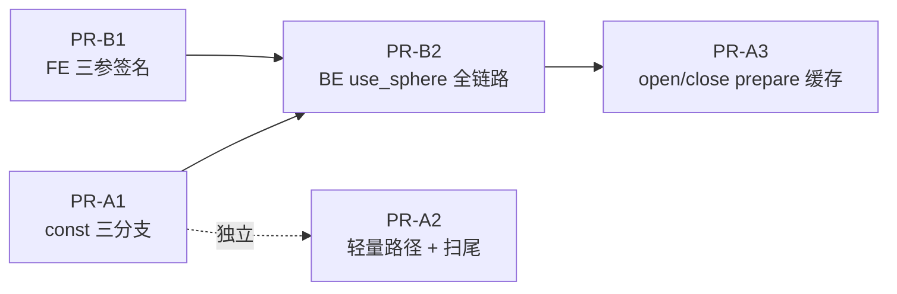

# Doris Geo 重构技术方案

| 项 | 内容 |
|----|------|
| 文档状态 | 待评审 |
| 涉及模块 | BE `exprs/function/geo`、FE Nereids 函数签名 |
| 方案范围 | ① 执行层性能优化（Batch / 对象复用 / prepare 缓存）；② 空间关系函数二维/三维计算一致性 |
| 相关文档 | [`geo-spatial-design.md`](./geo-spatial-design.md)、[`geo-batch-reuse-plan.md`](./geo-batch-reuse-plan.md)、[`constant-fold-geo-analysis.md`](./constant-fold-geo-analysis.md)、[`架构建议.md`](./架构建议.md)、飞书 [GEO二维/三维计算一致性分析](https://pansw43kpjc.feishu.cn/wiki/O4sKw6Z5BiKddRkb1nDcGEc4n0d) |

---

## 1. 背景与问题

Doris 当前的 Geo 能力采用「函数层 GIS + VARCHAR 载体」模型：几何对象在 SQL 类型系统中以 `VARCHAR`/`STRING` 表示，内部承载自定义二进制编码；所有几何解析与空间计算在 BE 基于 Google S2 执行；FE 不做几何计算，`st_*` 函数被常量折叠显式跳过（`FoldConstantRuleOnBE.shouldSkipFold`）。

在该架构下，本方案要解决两个相互独立的问题。

### 1.1 问题一：执行层性能——批量执行中重复 decode

空间关系函数 `st_contains` / `st_intersects` / `st_disjoint` / `st_touches`（BE 侧统一为 `StRelationFunction` 模板）在 batch 内逐行执行：

```cpp
// be/src/exprs/function/geo/functions_geo.cpp — StRelationFunction::execute（现状）
for (int row = 0; row < size; ++row) {
    auto lhs_value = left_col.value_at(row);
    auto rhs_value = right_col.value_at(row);
    std::unique_ptr<GeoShape> shape1(GeoShape::from_encoded(...));  // 每行 decode
    std::unique_ptr<GeoShape> shape2(GeoShape::from_encoded(...));  // 每行 decode，即使该列是常量
    auto relation_value = Func::evaluate(shape1.get(), shape2.get());
}
```

典型查询 `WHERE ST_Contains(region, ST_Point(116.4, 39.9))` 中，右侧点在整个查询内不变，但每行都会完整执行一次 `from_encoded`（解码 + 堆分配 + S2 对象构造）。百万行即百万次无效解码；左侧为常量大多边形时（如省级边界），浪费更为显著。由于 FE 对 `st_*` 不做常量折叠（FE 无法表示 Geo 二进制值，详见 `constant-fold-geo-analysis.md`），该开销无法在计划期消除，只能在执行层解决。

同文件中 `StDistance` 已实现 `unpack_if_const` + `const_vector` / `vector_const` / `vector_vector` 三分支，证明该优化模式在当前代码框架内可行且有先例。

### 1.2 问题二：语义一致性——二维/三维计算路径结果不一致

空间关系函数基于 S2 的三维球面模型计算，而用户（尤其从 PostGIS / MySQL 迁移的用户）通常预期平面二维语义。两种模型对同一输入可能给出不同结果——例如长线段与多边形的相交判断，球面大圆路径与平面直线路径可能穿过不同区域。当前引擎无法让用户选择计算模型，也无法在一条 SQL 中表达「按平面语义判断」。

经前期分析（见飞书文档），候选方案已完成对比，**结论为采用方案一：为四个空间关系函数增加可选第三参数 `use_sphere BOOLEAN`**。本文档给出该决策的落地设计。

## 2. 目标与非目标

### 2.1 目标

| 编号 | 目标 | 度量 |
|------|------|------|
| G1 | 消除常量侧几何对象的重复 decode | 常量侧 decode 次数从 O(N) 降至 O(1)（Phase A5 后进一步降至每 fragment 1 次）；`ST_Contains(col, 常量)` 类查询 CPU 显著下降 |
| G2 | 降低轻量函数的无效开销 | `ST_GeometryType` 不再做完整 S2 decode |
| G3 | 提供二维/三维计算模型的 SQL 级选择能力 | 四个关系函数支持 `use_sphere` 第三参，同一 SQL 内可混用两种模式 |
| G4 | 全程语义兼容 | 存量两参写法的结果与现版本完全一致（含 NULL / 非法输入路径） |

### 2.2 非目标

以下内容明确不在本方案范围内，避免评审发散：

- **空间索引**（R-tree / S2 Cell 谓词下推）：属长期演进，见 `架构建议.md` 第三、四层。
- **原生 GEOMETRY 类型 / `ColumnGeo`**：大版本工程，不在本期。
- **FE 对 `st_*` 的常量折叠**：受 FE 类型表示能力限制，维持现状。
- **VARCHAR 编码格式变更**（如 blob 内嵌 bbox）：涉及存量数据兼容，单独立项。
- **`GeoShape` 全局对象池 / 重复 blob 通用缓存**：收益未证实、易错，首版不做（注意与 Phase A5 的 const 侧 prepare 缓存区分：后者只缓存常量参数，范围明确）。
- **会话变量切换计算模型（原方案二）**：见 §5.1 备选方案对比，本期不实施。

## 3. 方案总览

方案包含两条独立工作流（Workstream），改动均收敛于 `be/src/exprs/function/geo/` 与 FE 四个函数签名类，可并行推进、独立交付、独立回滚：

| 工作流 | 解决的问题 | 核心手段 | 是否改变对外行为 |
|--------|-----------|----------|-----------------|
| **WS-A 执行层性能** | §1.1 重复 decode | const/vector 三分支、编码头轻量读取、循环外槽位复用、`open/close` prepare 缓存 | 否（纯性能优化，结果不变） |
| **WS-B 计算模型选择** | §1.2 二维/三维不一致 | 四函数新增可选 `use_sphere` 参数，BE 增加二维计算路径 | 新增能力；存量写法行为不变 |

两条工作流在 `StRelationFunction` 上存在改动交集，合入顺序在 §8 中约定。

## 4. 详细设计：WS-A 执行层性能

### 4.1 备选方案对比与决策

| 方案 | 说明 | 优点 | 缺点 | 结论 |
|------|------|------|------|------|
| A-1 execute 内 `unpack_if_const`（**Phase A1**） | 在 `execute` 内判断常量列，分支处理 | 与现有 `StDistance` 模式一致；改动局部、无框架依赖；可快速落地 | 缓存生命周期仅单次 execute 调用，不跨 block | **首期采用** |
| A-2 StarRocks 式 open/close 状态缓存（**Phase A5**） | `open` 阶段 decode 常量并存入 `FunctionContext`，跨 block 复用 | 收益覆盖并超过 A-1（跨 batch 复用）；模式更通用，构造函数如 `st_circle` / `st_from_wkt` 同样受益 | 需把 `FunctionContext` 接入目前将其丢弃的 `GeoFunction` 执行链路，改动比 A-1 稍大 | **纳入本方案**（详见 §4.5）。经源码核实框架能力已齐备，无框架级缺口 |
| A-3 不做，等待常量折叠 | 依赖 FE 折叠消除常量子树 | 无 BE 改动 | FE 无法表示 Geo 值，短期不可行 | 否决 |

A-1 与 A-2 不冲突：Phase A1 先落地拿到单 block 内收益并完成三分支代码结构，Phase A5 在其上升级为跨 block 复用。机制对比详见附录 A。

### 4.2 Phase A1：关系函数 const 三分支（最高 ROI）

改造 `StRelationFunction`，对齐 `StDistance` 现有模式：

1. `unpack_if_const` 解包左右列。
2. 抽出共用 helper：`decode_shape(StringRef) -> std::unique_ptr<GeoShape>`。
3. 按常量分布走三个分支：

| 分支 | 场景 | 行为 |
|------|------|------|
| `vector_const` | 右侧常量（最常见，如 `ST_Contains(region, ST_Point(...))`） | 右侧 decode 一次，循环内只 decode 左侧 |
| `const_vector` | 左侧常量（如固定大区边界过滤点列） | 对称处理；大 Polygon decode 收益最显著 |
| `vector_vector` | 两侧均为列 | decode 次数无法减少；循环外复用两个 `unique_ptr` 槽位，消除临时对象构造 |

4. 错误路径对齐 `StDistance`：const 侧 decode 失败时**整列置 NULL**，不逐行重试。

收益量化（以右侧常量、N 行为例）：decode 次数从 `2N` 降至 `N + 1`；右侧从 N 次降为 1 次。

本 Phase 不启用 `StContainsState`（留待 Phase A5），不改变任何结果语义。

### 4.3 Phase A2：轻量路径 — `ST_GeometryType`

当前 `ST_GeometryType` 为取类型名而执行完整 decode（大多边形需解整棵 S2 结构）。编码布局的前 2 字节已含类型信息：

```text
[0x00][GeoShapeType][S2 payload...]
 保留    类型枚举     坐标等（本函数不需要）
```

在 `geo_types` 增加 `GeoShape::type_name_from_encoded` 类 helper，只读头部映射 `"ST_POINT"` / `"ST_POLYGON"` 等；非法头返回 NULL。输出字符串与现版本逐字节一致。

附带项：复核 `ST_X` / `ST_Y`（现已用栈上 `GeoPoint` + `decode_from`，无需大改）；对外保持约 13 位小数行为，热点待 profiling 证实后另行小改。

### 4.4 Phase A3 / A4：分配减负与同类扫尾

- **A3**：在 `vector_vector` 分支上，循环外预置左右 `unique_ptr<GeoShape>` 槽位，每行仅替换所指对象；不引入对象池与通用 blob cache。
- **A4**（follow-up）：一元函数 `st_astext` / `st_length` / `st_area_*` 采用同样的循环外槽位复用；`st_distance` 已是模板，不动。

### 4.5 Phase A5：升级为 open/close prepare 缓存（跨 block 复用）

Phase A1 的 const 分支只在单次 `execute` 内生效：同一常量在每个 block 到来时仍要重新 decode 一次。Phase A5 把常量侧 decode 提前到函数 `open` 阶段、缓存进 `FunctionContext`，整个 fragment 生命周期只 decode 一次（与 StarRocks `st_contains_prepare` 同构）。

#### 4.5.1 框架就绪性（已核实源码，非假设）

| 所需能力 | Doris 现状 | 位置 |
|----------|-----------|------|
| 函数级 `open/close` 钩子 | `IFunctionBase::open/close` 虚函数已存在，默认空实现 | `be/src/exprs/function/function.h` |
| 常量列检测与获取 | `FunctionContext::is_col_constant(i)` / `get_constant_col(i)`；常量列由 `VExpr::open` 阶段统一填充（`set_constant_cols`） | `be/src/exprs/function_context.h`、`vexpr.cpp` |
| 跨 block 状态挂载 | `set_function_state` / `get_function_state`，支持 `FRAGMENT_LOCAL` / `THREAD_LOCAL` 双 scope | `be/src/exprs/function_context.cpp` |
| 同类先例 | `convert_tz`（FRAGMENT_LOCAL 缓存时区解析）、`like` / `regexp`（缓存编译后 pattern）、`dict_get` 等均为「open 读常量列 → 建 state → execute 复用」模式 | `function_convert_tz.cpp` 等 |
| 状态结构体 | `StContainsState` / `StConstructState` 已在头文件定义（当前零引用的空壳） | `functions_geo.h` |

结论：**无框架级缺口，不需要动 FE / thrift / 函数注册工厂**。此前评估中「需先确认 Doris `IFunction` 等价 API」的疑问已消除。

#### 4.5.2 现状缺口与改动点

唯一的真实缺口在 Geo 自身：`GeoFunction::execute_impl` 拿到 `FunctionContext*` 后直接丢弃，`Impl::execute` 签名里没有 context：

```cpp
// functions_geo.h — 现状：context 被丢弃
Status execute_impl(FunctionContext* context, Block& block, const ColumnNumbers& arguments,
                    uint32_t result, size_t input_rows_count) const override {
    return Impl::execute(block, arguments, result);
}
```

改动分四步（对齐 `convert_tz` 先例）：

1. **`GeoFunction` 实现 `open/close`**：`FRAGMENT_LOCAL` scope 下，对关系函数检查 `is_col_constant(0/1)`；有常量侧则 `get_constant_col` → `GeoShape::from_encoded` → 存入 `StContainsState`（`shared_ptr` 交给 `set_function_state`，无需手工 delete）。常量侧 decode 失败置 `state->is_null`，execute 直接整列 NULL（与 Phase A1 语义一致）。
2. **打通 context 传递**：`Impl::execute` 增加 `FunctionContext*` 参数（或仅对关系函数做特化模板，其余 Impl 不动，改动更小）。
3. **`StRelationFunction::execute` 读 state**：有缓存侧直接用 `state->shapes[i]`，变侧沿用 Phase A1 的逐行 decode / 槽位复用；state 为空时退回 Phase A1 路径（两模式共存，保证渐进可回滚）。
4. **第二批扩展构造函数**（可选，随 follow-up PR）：`st_circle` / `st_geomfromtext` 等启用 `StConstructState` 缓存 `encoded_buf`，全常量参数时整列结果只算一次。

#### 4.5.3 与 Phase A1 的关系与收益

| | Phase A1（execute 内） | Phase A5（open 阶段） |
|--|----------------------|----------------------|
| 常量侧 decode 次数 | 每个 block 1 次（扫 100 个 block 即 100 次） | 每个 fragment **1 次** |
| 依赖 | 无 | 依赖 Phase A1 的三分支代码结构 |
| 回滚 | — | state 为空自动退回 A1 路径 |

Phase A1 完成后，A5 的增量改动主要是 `open/close` 与 state 读写，预计为中小规模单 BE PR（`functions_geo.h/.cpp` + UT）。

注意事项：

- **scope 选择**：跟 `convert_tz` 用 `FRAGMENT_LOCAL`（常量列在 fragment open 时已就绪）；不用 `THREAD_LOCAL`。
- **模板影响面**：`GeoFunction` 是全部 geo 函数共用模板，`open` 内必须按 Impl 类型分流（如通过 trait 判定是否启用缓存），避免给不需要缓存的函数挂无用 state。
- **与 WS-B 组合**：第三参 `use_sphere` 为常量时不影响本缓存（缓存的是几何对象，与计算模型正交）。

## 5. 详细设计：WS-B 计算模型选择（`use_sphere`）

### 5.1 备选方案对比与决策

| 方案 | 说明 | 优点 | 缺点 | 结论 |
|------|------|------|------|------|
| B-1 函数第三参 `use_sphere`（**选定**） | `st_intersects(g1, g2, use_sphere)`，四函数同步支持 | 表达式级粒度，同一 SQL 可混用两种模式；语义显式、可审计；不依赖会话状态 | 需改 FE 签名 + BE arity，改动面较大 | **采用** |
| B-2 会话变量统一切换 | 不改 SQL，`TQueryOptions` 下发布尔开关 | SQL 零改动 | 无法在同一查询内混用；会话状态隐式影响结果，排障困难；工程上仍需打通 BE 取会话选项的管道 | 本期不做；如后续实施，约定第三参优先于会话变量 |
| B-3 新函数名（如 `st_intersects_2d`） | 语义并行的函数族 | 实现最简单 | 函数数量翻倍，签名爆炸；与 OGC 命名习惯不符 | 否决 |

默认值决策：两参写法默认 `use_sphere = true`（沿用现有 S2 球面行为），保证存量查询结果不变。`DEFAULT_USE_SPHERE` 在 BE 以常量集中定义。

> 待评审确认：默认值是否长期锚定 `true`。若未来希望对齐 PostGIS 平面语义（默认 `false`），需走行为变更流程，本方案不涉及。

### 5.2 SQL 语义定义

```sql
-- 三维球面（显式指定；与现版本默认行为一致）
SELECT ST_Intersects(g1, g2, true);

-- 二维平面
SELECT ST_Intersects(g1, g2, false);

-- 两参：默认行为，与升级前完全一致
SELECT ST_Intersects(g1, g2);
```

- 适用函数：`st_intersects` / `st_disjoint` / `st_contains` / `st_touches`（当前 Nereids 已注册的全部空间关系函数）。
- 第三参为普通布尔表达式，允许列值（逐行生效）、常量与 NULL；NULL 遵循函数整体的 `AlwaysNullable` / `PropagateNullLiteral` 语义。
- 语义约束：任意 `use_sphere` 取值下，`st_disjoint(g1, g2, s) == NOT st_intersects(g1, g2, s)` 必须成立（允许数值误差内）。

### 5.3 FE 设计

**关键约束：与 `BinaryExpression` 解绑。** 现四个 `St*` 类实现 `BinaryExpression`（固定两子节点），与 2/3 参并存冲突。改为仅继承 `ScalarFunction` + `ExplicitlyCastableSignature` + `AlwaysNullable` + `PropagateNullLiteral`，`withChildren` 允许 2 或 3 个子节点：

```java
// StIntersects.java — 结构示意
public class StIntersects extends ScalarFunction
        implements ExplicitlyCastableSignature, AlwaysNullable, PropagateNullLiteral {

    public static final List<FunctionSignature> SIGNATURES = ImmutableList.of(
            FunctionSignature.ret(BooleanType.INSTANCE)
                    .args(VarcharType.SYSTEM_DEFAULT, VarcharType.SYSTEM_DEFAULT),
            FunctionSignature.ret(BooleanType.INSTANCE)
                    .args(StringType.INSTANCE, StringType.INSTANCE),
            FunctionSignature.ret(BooleanType.INSTANCE)
                    .args(VarcharType.SYSTEM_DEFAULT, VarcharType.SYSTEM_DEFAULT, BooleanType.INSTANCE),
            FunctionSignature.ret(BooleanType.INSTANCE)
                    .args(StringType.INSTANCE, StringType.INSTANCE, BooleanType.INSTANCE));

    public StIntersects(Expression arg0, Expression arg1) {
        super("st_intersects", arg0, arg1);
    }

    public StIntersects(Expression arg0, Expression arg1, Expression arg2) {
        super("st_intersects", arg0, arg1, arg2);
    }

    @Override
    public StIntersects withChildren(List<Expression> children) {
        Preconditions.checkArgument(children.size() == 2 || children.size() == 3);
        return new StIntersects(getFunctionParams(children));
    }
    // getSignatures / accept 不变，仍走 visitStIntersects
}
```

FE 改动清单：

| 文件 | 改动 |
|------|------|
| `.../scalar/StIntersects.java` | 去 `BinaryExpression`；新增三参签名与构造；放宽 `withChildren` |
| `.../scalar/StDisjoint.java` / `StContains.java` / `StTouches.java` | 同上 |
| 依赖 `BinaryExpression` 的 Nereids 规则（如有） | 排查并解除依赖 |

### 5.4 BE 设计

#### 5.4.1 函数注册 arity（必须与 FE 一致）

现状：`GeoFunction` 以 `Impl::NUM_ARGS` 声明固定参数个数，`is_variadic() == false`，`StRelationFunction` 内 `DCHECK_EQ(arguments.size(), 2)`。**不允许**只在 `execute` 里偷读第三列而不改注册元数据，否则 FE 解析、函数工厂 arity 与 BE 执行三者不一致。

两个候选实现，评审时二选一：

| 策略 | 做法 | 评估 |
|------|------|------|
| 双注册 | 保留 `NUM_ARGS = 2` 特化，另增 `NUM_ARGS = 3` 特化，`register_function_geo` 同名注册两个 | 结构简单；需确认 `SimpleFunctionFactory` 同名多签名分发与 FE 一致 |
| Variadic 特化 | 关系函数单独实现 `IFunction` 子类，`is_variadic() == true`，允许 2/3 参，`execute` 内分支 | 单一入口；实现稍复杂 |

无论选哪种，`functions_geo.h` 都需要修改（不能只改 `.cpp`）。

#### 5.4.2 `GeoShape` API

```cpp
// geo_types.h — 签名变更示意
class GeoShape {
public:
    virtual bool intersects(const GeoShape* rhs, bool use_sphere) const;
    virtual bool disjoint(const GeoShape* rhs, bool use_sphere) const;
    virtual bool contains(const GeoShape* rhs, bool use_sphere) const;
    virtual bool touches(const GeoShape* rhs, bool use_sphere) const;

    // 无参重载：转发 DEFAULT_USE_SPHERE（= true，保持兼容）
    virtual bool intersects(const GeoShape* rhs) const {
        return intersects(rhs, DEFAULT_USE_SPHERE);
    }
    // disjoint / contains / touches 同理
};
```

- `GeoPoint` / `GeoLine` / `GeoPolygon` / `GeoCircle` / `GeoMultiPolygon` 按需 override，内部以 `_2d` / `_3d` 私有方法分发。
- `GeoMultiPolygon` 必须把 `use_sphere` 透传至内部 polygon 逻辑。
- 不变式：`disjoint(rhs, s) == !intersects(rhs, s)` 对两种模式均成立。

#### 5.4.3 二维计算辅助函数（`geo_types.cpp`）

| 函数 | 算法要点 |
|------|----------|
| `is_polygon_intersects_line_2d` | 线段与边界相交；或线段中点在多边形内 |
| `is_polygon_intersects_polygon_2d` | 边界相交；或顶点在对方内部 |
| `is_polygon_contains_point_2d` | ray casting；排除边界点（与现有 `contains` 边界语义一致，容差 `1e-6`） |
| `is_polygon_contains_line_2d` | 全部顶点在内且线段不穿越边界 |
| `is_polygon_contains_polygon_2d` | inner 全部顶点在 outer 内 |
| `is_polygon_touches_line_2d` / `is_polygon_touches_polygon_2d` | 边界接触且无内部重叠 |
| `is_circle_intersects_polygon_2d` / `is_circle_touches_polygon_2d` / `is_circle_contains_point_2d` | 平面距离模型 |

#### 5.4.4 执行体

第三参逐行读取（列值场景），`ColumnConst` 时提为循环外常量；**禁止用 `get_bool(0)` 代表整列**：

```cpp
// 伪代码
for (int row = 0; row < size; ++row) {
    bool use_sphere = default_use_sphere;
    if (has_third_arg) {
        use_sphere = third_arg_view.get_bool(row);
    }
    auto relation_value = Func::evaluate(shape1.get(), shape2.get(), use_sphere);
    res->get_data()[row] = relation_value;
}
```

与 WS-A 的组合：`use_sphere` 为常量列时同样纳入 const 分支优化，几何常量侧的一次性 decode 与计算模型选择正交。

#### 5.4.5 BE 改动清单

| 文件 | 改动 | 备注 |
|------|------|------|
| `geo_types.h` | `use_sphere` 重载与内部分发声明 | |
| `geo_types.cpp` | 二维辅助函数 + 各类型实现 | 体量最大 |
| `functions_geo.h` | arity 策略（双注册或 variadic） | 评审确定后实施；易遗漏 |
| `functions_geo.cpp` | 执行体、按行读第三参 | 与 WS-A 改动同文件，注意合入顺序 |
| `PaloInternalService.thrift` | 本期**不改**；仅未来实施 B-2 时新增 `TQueryOptions` 字段 | |

## 6. 兼容性分析

| 维度 | 影响 | 结论 |
|------|------|------|
| 存量 SQL（两参写法） | 走原三维球面路径，结果不变 | 兼容 |
| 存量数据（VARCHAR 编码 blob） | 编码格式不变 | 兼容 |
| NULL / 非法输入 | WS-A 错误路径对齐 `StDistance`（const 侧非法 → 整列 NULL，与逐行 NULL 语义一致，Phase A1/A5 行为相同）；WS-B 遵循既有 nullable 语义 | 兼容 |
| 输出精度 | `ST_AsText` 13 位小数、`contains` 边界容差 `1e-6` 均不变 | 兼容 |
| 升级/降级 | 纯函数层改动，无持久化格式变化；降级后三参 SQL 报「函数不存在」，属预期 | 可接受 |
| 生态对比 | 第三参为 Doris 扩展语法；PostGIS 无此参数（其 `geometry`/`geography` 类型天然区分两种模型） | 需在用户文档中说明 |

## 7. 测试方案

### 7.1 单元测试（BE）

| 文件 | 覆盖 |
|------|------|
| `be/test/exprs/function/geo/function_geo_test.cpp` | WS-A：const_vector / vector_const / vector_vector 三分支结果一致性；const 侧非法整列 NULL；Phase A5 open/execute/close 生命周期（含 state 命中与未命中路径结果一致）。WS-B：三参执行（含常量列、列值列、NULL） |
| `be/test/exprs/function/geo/geo_types_test.cpp` | WS-B：同一输入二维/三维路径结果对比；`disjoint == !intersects` 不变式（两种模式） |

### 7.2 回归测试

- 目录：`regression-test/suites/query_p0/sql_functions/spatial_functions/`。
- 存量 `test_gis_function.groovy` 必须零 diff 通过（G4 的直接验证）。
- 新增用例：四函数三参（true/false/缺省/NULL/列值）端到端行为，遵循仓库规范（`order_qt`、错误用 `test-exception`、结果由脚本生成 `.out`）。

### 7.3 性能验证

- 基准：`WHERE ST_Contains(region, ST_Point(...))`（vector_const）与大多边形 const_vector 场景，对比改前后 CPU / 耗时。
- Phase A5 增量验证：多 block 大表场景（常量侧 decode 从每 block 一次降为每 fragment 一次），对比 A1 与 A5 的差值。
- 可选用 `opensky_p2` 真实负载复核。

### 7.4 质量门禁

`./run-be-ut.sh` 通过；`./run-regression-test.sh -d query_p0/sql_functions/spatial_functions` 通过；`build-support/clang-format.sh` / clang-tidy 通过；FE 改动过 checkstyle。

## 8. 实施计划

### 8.1 PR 切分

| PR | 内容 | 依赖 |
|----|------|------|
| **PR-A1** | Phase A1：关系函数 const 三分支 + UT/回归 | 无 |
| **PR-B1** | FE：四函数解绑 `BinaryExpression`、新增三参签名 | 无（可与 PR-A1 并行） |
| **PR-B2** | BE：`use_sphere` API + 二维辅助 + arity + 执行体 + UT/回归 | PR-B1；建议在 PR-A1 合入后进行，避免 `StRelationFunction` 冲突 |
| **PR-A2** | Phase A2 `ST_GeometryType` 轻量路径 + A3/A4 扫尾 | 可随时穿插 |
| **PR-A3** | Phase A5：`GeoFunction` open/close prepare 缓存（先关系函数；构造函数缓存可拆 follow-up） | PR-A1（复用三分支结构）；建议在 PR-B2 之后，避免三方冲突 |



### 8.2 任务清单

| ID | 内容 | 所属 | 状态 |
|----|------|------|------|
| phase1-relation-const | `StRelationFunction` 三分支 + UT/回归 | WS-A | pending |
| phase2-geometry-type | 编码头读 type_name，`StGeometryType` 去 full decode | WS-A | pending |
| phase2-xy-review | 复核 `ST_X`/`ST_Y`，保持对外精度语义 | WS-A | pending |
| phase3-loop-reuse | vector_vector 循环外槽位复用 | WS-A | pending |
| phase4-unary-followup | 一元函数扫尾（可选） | WS-A | pending |
| phase5-prepare-cache | `GeoFunction` open/close + `StContainsState` 启用 + context 链路打通 | WS-A | pending |
| phase5-construct-cache | （可选）构造函数启用 `StConstructState` | WS-A | pending |
| sphere-fe-signature | 四 `St*` 解绑 `BinaryExpression` + 三参签名 | WS-B | pending |
| sphere-be-api | `GeoShape` `use_sphere` 重载 + 二维辅助 | WS-B | pending |
| sphere-be-arity | `functions_geo.h` arity 策略落地 | WS-B | pending |
| sphere-be-execute | 执行体按行分发 2d/3d | WS-B | pending |
| sphere-tests | UT + 回归 | WS-B | pending |
| docs-update | 回写 `优化项.md` / `geo-spatial-design.md` §7.3 | 公共 | pending |

## 9. 风险与应对

| 风险 | 等级 | 应对 |
|------|------|------|
| 二维路径与三维路径在边界 case（点在边上、共线、极点/跨反子午线）行为差异未充分定义 | 高 | UT 显式覆盖边界 case；`disjoint == !intersects` 不变式测试兜底；语义以 §5.2 定义为准并写入用户文档 |
| `SimpleFunctionFactory` 同名多 arity 注册行为与 FE 分发不一致（双注册策略） | 中 | PR-B2 前先做注册链路 spike；不满足则改用 variadic 特化 |
| WS-A 与 WS-B 同时改 `StRelationFunction` 产生合入冲突 | 中 | §8.1 已约定顺序：A1 先行，B2 基于 A1，A3（prepare 缓存）最后 |
| `GeoFunction` 为全部 geo 函数共用模板，`open` 逻辑误挂到不需要缓存的函数 | 中 | 按 Impl trait 分流，仅关系函数（及后续构造函数）启用；UT 覆盖无缓存函数的 open 空路径 |
| const 侧非法 blob 整列 NULL 与逐行语义在极端场景存在感知差异 | 低 | 与 `StDistance` 现行为一致，属既有先例；回归用例固化 |
| Nereids 存在隐式依赖 `BinaryExpression` 的规则 | 低 | PR-B1 全量排查 `instanceof BinaryExpression` 对四类的引用 |

## 10. 待评审确认项

1. **BE arity 策略**：双注册 vs variadic 特化（§5.4.1），倾向先 spike 双注册。
2. **`DEFAULT_USE_SPHERE` 默认值**：本方案定为 `true`（兼容优先）；是否有长期对齐 PostGIS 平面语义的诉求。
3. **Phase A4（一元函数扫尾）是否随 PR-A2 交付**，或降级为技术债跟踪。
4. **Phase A5 的 context 传递方式**：统一给 `Impl::execute` 加 `FunctionContext*` 参数，还是仅对关系函数做特化模板（后者改动更小，推荐）。
5. **Phase A5 构造函数缓存（`StConstructState`）是否随 PR-A3 交付**，或拆为独立 follow-up。
6. **性能基准口径**：是否要求在 `opensky_p2` 负载上给出量化报告作为 PR-A1 / PR-A3 验收条件。

---

## 附录 A：Phase A1 / A5 / StarRocks 机制对比

| | Doris Phase A1 | Doris Phase A5（本方案） | StarRocks 现有实现 |
|--|---------------|-------------------------|-------------------|
| 检测时机 | execute 内 `unpack_if_const` | `open` 阶段 `is_col_constant()` | prepare 阶段 `ctx->is_constant_column()` |
| 缓存载体 | 函数内局部变量 | `FunctionContext` FRAGMENT_LOCAL state（`StContainsState`） | `FunctionContext` FRAGMENT_LOCAL state |
| 生命周期 | 单次 execute 调用 | open → execute × N → close，跨 batch | prepare → execute → close，跨 batch |
| 覆盖范围 | 关系函数 | 关系函数（第二批扩展构造函数） | 关系函数、构造函数（`st_circle`、`st_from_wkt`）等通用 |

结论：A1 以最小改动获得单 block 收益并搭好三分支结构；A5 在此之上启用 `functions_geo.h` 中遗留的 `StContainsState`，达到与 StarRocks 等价的跨 block 复用。框架侧 `open/close` / 常量列 API / state 挂载均已具备（见 §4.5.1），A5 为纯 Geo 模块内改动。

## 附录 B：参考资料

- [`geo-batch-reuse-plan.md`](./geo-batch-reuse-plan.md) — WS-A 各 Phase 的 SQL/行为示例与 StarRocks 实现详解
- [`geo-spatial-design.md`](./geo-spatial-design.md) — Geo 现状架构、限制与测试体系
- [`constant-fold-geo-analysis.md`](./constant-fold-geo-analysis.md) — FE 不对 `st_*` 常量折叠的原因（Doris vs StarRocks）
- [`架构建议.md`](./架构建议.md) — 分层演进路线（bbox / S2 Cell / 原生类型）
- 飞书 [GEO二维/三维计算一致性分析](https://pansw43kpjc.feishu.cn/wiki/O4sKw6Z5BiKddRkb1nDcGEc4n0d) — WS-B 方案对比原始材料（方案一已选定）
- 代码：`be/src/exprs/function/geo/`；回归：`regression-test/suites/query_p0/sql_functions/spatial_functions/`
