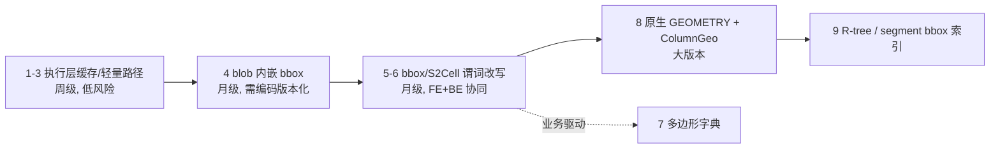

# Doris Geo 性能提升架构建议

> 基于当前 Doris「函数层 GIS + VARCHAR 载体」实现，对照 StarRocks、DuckDB、ClickHouse 与前沿实践给出的分层建议。  
> 相关文档：[`geo-spatial-design.md`](./geo-spatial-design.md)、[`geo-batch-reuse-plan.md`](./geo-batch-reuse-plan.md)、[`优化项.md`](./优化项.md)。

## 一句话判断

Doris Geo 目前是「**函数层 GIS**」：VARCHAR blob + 逐行 decode + 无索引。与几家系统对比，差距不在算法（S2 本身不差），而在 **数据表示** 和 **过滤时机**。

建议路线：

- **短期**：抄 StarRocks（执行层 const 缓存）
- **中期**：抄 ClickHouse（bbox 预筛 + 多边形字典思路）
- **长期**：抄 DuckDB（原生 GEOMETRY + 缓存 bbox + R-tree）

## 各家核心可借鉴点

| 系统 | 关键设计 | 对 Doris 的启示 |
|------|----------|----------------|
| **StarRocks** | `st_contains_prepare` 在 `FunctionContext` 里缓存 const 侧已 decode 的 `GeoShape`，fragment 生命周期内跨 batch 复用 | 成本最低、可直接落地。Doris `functions_geo.h` 里的空壳 `StContainsState` 就是这个思路的遗留，补上 `prepare/close` 即可，且比 execute 内 `unpack_if_const` 更通用（跨 block 复用） |
| **ClickHouse** | ① geo 类型是 `Tuple/Array` 原生列的别名，**没有不透明 blob**，坐标天然列式可向量化；② `pointInPolygon` 在主键分析时用 **多边形 bbox 与 granule 范围求交** 做粒度裁剪；③ **Polygon Dictionary**：网格递归索引，把「亿级点 × 多边形集」变成字典 lookup | bbox 预筛是 ROI 最高的「准索引」；多边形字典对反向地理编码场景（点找区域）是数量级提升 |
| **DuckDB** | ① 原生 `GEOMETRY` 列**内嵌缓存 bbox**，读 MBR 不需要解顶点（省 15–30% 重复解析）；② R-tree 索引，STR 自底向上批量构建 + `ST_Hilbert` 排序提升空间局部性；③ 索引只服务于一组明确的相交类谓词 | 「blob 里带 bbox 头」这一点 Doris 可以低成本借鉴——不需要完整 GEOMETRY 类型，也能让过滤跳过完整 decode |
| **前沿研究/生态** | GeoArrow/GeoParquet 列式几何布局；S2/H3 cell 化（把空间问题降维成整数问题）；学习型空间索引（如 RSMI/LISA 系）目前工程落地少 | Doris 已依赖 S2，**cell 化是与现有栈最贴合的「索引替代」**；学习型索引不建议现在投入 |

## 分层建议

### 第一层：执行层（1–2 个 PR，改 `functions_geo`）

1. **关系函数 const 三分支**（见 [`geo-batch-reuse-plan.md`](./geo-batch-reuse-plan.md) Phase 1）：把 `StDistance` 的 `unpack_if_const` 模式推广到 `StRelationFunction`。
2. **升级为 StarRocks 式 prepare 缓存**：给 `GeoFunction` 实现 `open/close`，const 侧 `GeoShape` 存进 `FunctionContext`，跨 block 复用。比方案 1 覆盖面广（构造函数 `st_circle`、`st_from_wkt` 同样受益），Doris 头文件里的 `StContainsState` 直接能用。
3. **轻量路径**：`ST_GeometryType` 只读编码头 2 字节（见 plan Phase 2）。

### 第二层：数据表示（不引入新类型系统，改编码格式）

4. **blob 头内嵌 bbox**（借鉴 DuckDB 的 cached envelope）：编码格式从 `[0x00][type][payload]` 扩为 `[version][type][bbox: 4×double][payload]`，需要版本位做兼容。收益：
   - `ST_Contains` / `ST_Intersects` 先做 bbox 快速拒绝，**多数不相交行不再走完整 S2 decode + 精确判断**；
   - 为第三层的存储裁剪打基础。

   这是**单笔投入、全函数受益**的改造，风险点在编码兼容（旧数据识别、跨版本升级）。

### 第三层：过滤时机（借鉴 ClickHouse，不建 R-tree）

5. **bbox / ZoneMap 谓词改写**：FE 把 `ST_Contains(region_col, ST_Point(常量))` 自动补写成「点在列 bbox 内」的普通比较谓词（若表有 bbox 派生列，或 blob 头有 bbox 且 ZoneMap 可用），存储层先裁 granule，再逐行精算。ClickHouse 的 `pointInPolygon` PK 裁剪就是这个思路。
6. **S2 CellId 生成列 + 谓词改写**：常量多边形在 FE/BE 计划期算 S2 covering（一组 cell 区间），改写成 `s2_cell BETWEEN ...` 的 IN/区间过滤。这是与 Doris 现有 S2 依赖最契合的「索引替代」，ZoneMap / BloomFilter 天然可用。
7. **多边形字典（反向地理编码专用）**：若业务高频是「亿级点找所属区域」，参考 ClickHouse Polygon Dictionary，用网格索引做一个 `geo_dict` 类功能（可先做成 UDF / 内置表函数级别），避免全表 `ST_Contains` 笛卡尔式扫描。

### 第四层：长期（大版本工程）

8. **原生 GEOMETRY 类型 + `ColumnGeo`**：解决 FE 无法表示几何字面量（顺带解锁常量折叠）、序列化不透明、无法向量化三个根问题。参考 ClickHouse「geo 类型 = 原生嵌套列的别名」的做法可显著降低成本——不必发明全新存储格式，用 `Array(Tuple(Float64, Float64))` 式布局（对齐 GeoArrow）。
9. **R-tree 只在此之后考虑**：DuckDB 经验表明 R-tree 依赖原生 GEOMETRY + 缓存 bbox 才划算，且 OLAP 高吞吐写入下维护成本高（DuckDB 也建议批量 STR 构建、碎片化后重建）。对 Doris 这种 LSM 型存储，**segment 级 bbox 元数据（类 ZoneMap）比全局 R-tree 更贴合**。

## 优先级与依赖

**为什么这个顺序**：第 1–3 层每层都独立产生收益且互不阻塞后一层；而直接跳到 R-tree（很多人第一反应）在当前「不透明 blob」表示下根本做不了——DuckDB 文档明确指出 WKB blob 存储连读 MBR 都要重解析。**先把数据表示里的信息暴露出来（bbox、cell），过滤自然就有了**；这也是 ClickHouse 不做 R-tree 却性能不差的原因：它靠原生列式表示 + granule 级 bbox 裁剪 + 字典索引三件套。

## 务实提醒

1. **精度一致性是隐形约束**：Doris `contains` 边界语义（容差 `1e-6`）、WKT 13 位小数输出，任何表示层改造都要保回归结果不变，否则用户查询结果漂移比慢更糟。
2. **先测再投**：建议先用 opensky（`regression-test/suites/opensky_p2/`）这类真实负载建立基准，量化每层收益；第 1 层做完很可能已满足多数客户场景，第 3 层之后的投入应由真实业务需求（如反向地理编码规模）驱动。

## 与现有文档的关系

| 文档 | 关系 |
|------|------|
| [`geo-batch-reuse-plan.md`](./geo-batch-reuse-plan.md) | 对应本建议 **第一层 1、3** 的可执行计划 |
| [`优化项.md`](./优化项.md) | 含建模侧用法优化（拆经纬度 / 预计算列），与内核改造互补 |
| [`geo-spatial-design.md`](./geo-spatial-design.md) | 现状架构；本建议是其上的演进方向 |

## 参考

- StarRocks：`geo_functions` prepare / `StContainsState` 跨 batch 缓存
- DuckDB Spatial：原生 `GEOMETRY`、cached envelope、R-tree（STR bulk load + Hilbert）
- ClickHouse：`pointInPolygon` + granule bbox 裁剪、Polygon Dictionary
- GeoArrow / GeoParquet：列式几何布局
- Google S2 / Uber H3：球面格子与 covering（Doris 已依赖 S2）
